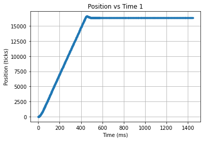
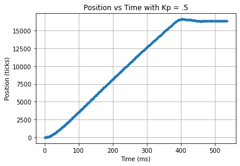

# Cal Poly ME-405
## Lab 03
Jacob Bograd, Nick De Simone, Horacio Albarran

Documentation: https://me-405.github.io/lab-3/

---

This lab modifies our closed loop controller from lab 02, before the controller utilized blocking 
sleep statements to control the sampling rate. The controller has been updated to act as a generator with a mini FSM
built into the design. All blocking sleep commands have been replaced with Yield's. This allows a scheduler to come into
the picture and swap between the different closed loop controllers. For this lab we controlled two differnt motors, one
of the motors used a hard-coded Kp value while the other took its Kp from a serial input from the host computer. Motor 2
then sends its data back to the computer for it to graph it. Three different graphs are shown below.  

When the motors are run too slowly the motor keeps overshooting causing massive oscillations, the microcontroller kept 
running out of memory whenever this happened due to the amount of data being recorded, so we are unable to show a Graph.

---
Graphs  
  
This graphs shows the motor with a Kp of 1  
  
This graph shows the motor with a Kp of 0.5  
  
This graph shows the motor with a Kp of 0.5 again  
